<h1>Activité pratique 3</h1>
<h2>Development Web JEE Spring MVC</h2>
<h3>Introduction</h3>

Ce rapport présente le développement d'une application web sécurisée utilisant Spring Boot et Spring Security, centrée sur la gestion des patients. Les étapes incluent la création d'un projet avec les dépendances nécessaires, la mise en place d'entités JPA pour les patients, la configuration de la persistance des données, l'élaboration d'un contrôleur Spring MVC et la création de vues Thymeleaf. La particularité clé du projet est sa souplesse de connexion à H2 ou MySQL. La sécurité est primordiale, avec l'intégration de Spring Security via trois stratégies d'authentification : InMemoryAuthentication, JdbcAuthentication et UserDetailsService. L'objectif final est de fournir une application web fonctionnelle, adaptable et sécurisée, en exploitant pleinement les fonctionnalités de Spring Boot et Spring Security.

<h3>Objectifs</h3>

Créer une application web JEE qui permet de gérer des patients

<h3>Enoncé :</h3>
<ol>
<li>Créer un projet spring boot avec les dépendances Web, Spring Data JPA, H2, Lombock, Thymeleaf</li>
<li>Créer l'entité JPA Patient</li>
<li>Créer l'interface PatientRepository basée sur Spring Data</li>
<li>Configurer l'application (application properties)</li>
<li>Créer le contrôleur Spring MVC</li>
</ol>
<h3>Procédure effectuée :</h3>
<ol>
<li>Créer un projet spring boot avec les dépendances Web, Spring Data JPA, H2,
Lombock, Thymeleaf</li>
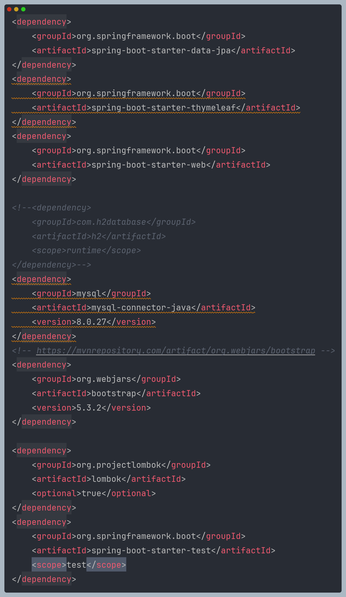
<li>Créer l'entité JPA Patient</li>
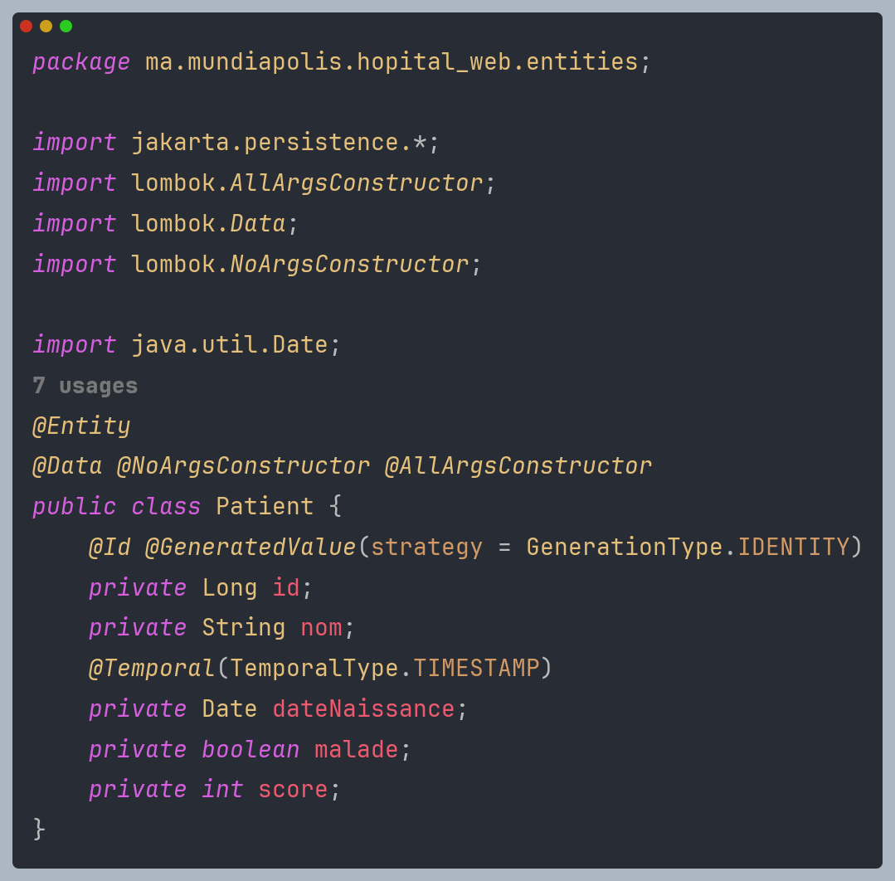
<li>Créer l'interface PatientRepository basée sur Spring Data</li>
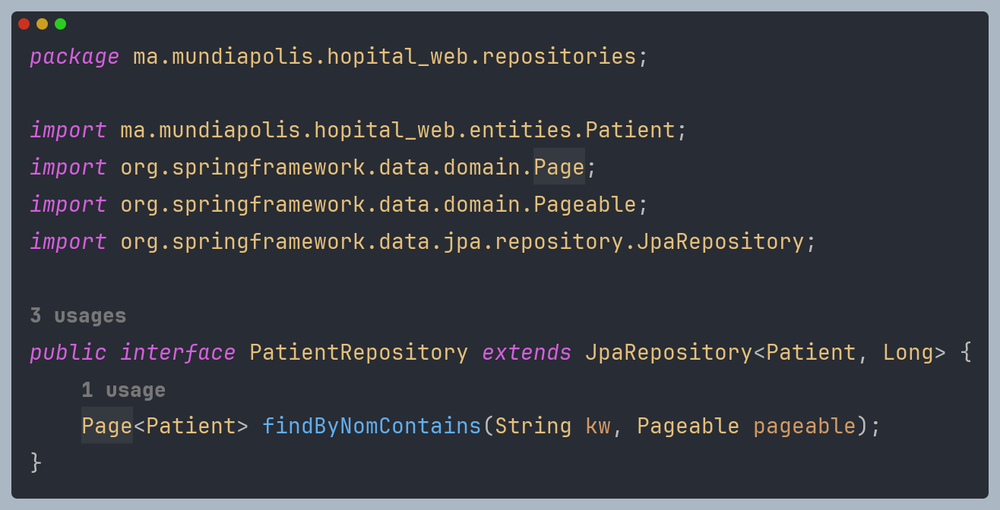
<li>Configurer l'application (application properties)</li>
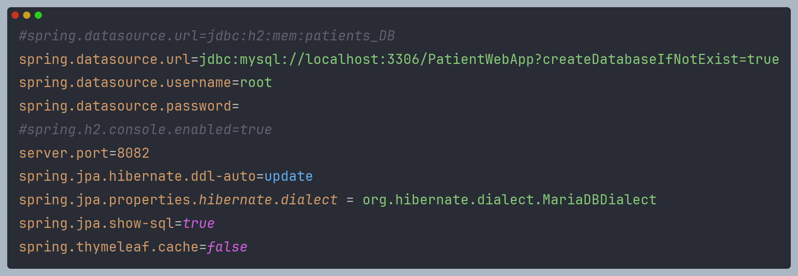
<li>Créer le contrôleur Spring MVC</li>

Partie qui gère l'affichage des patients avec la pagination

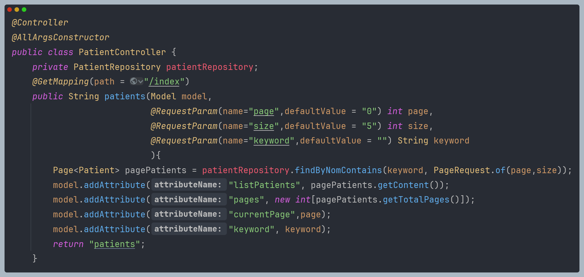

Partie qui concerne le bouton delete pour effacer un patient

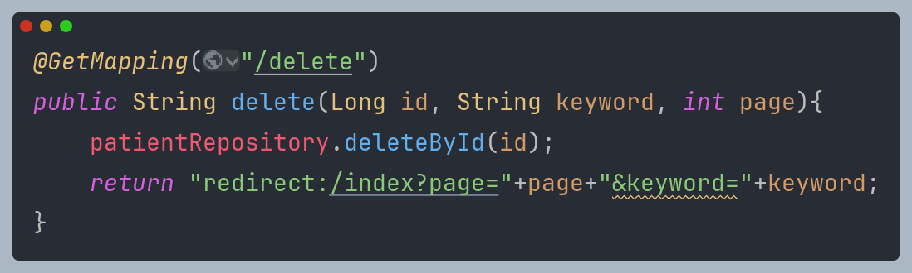
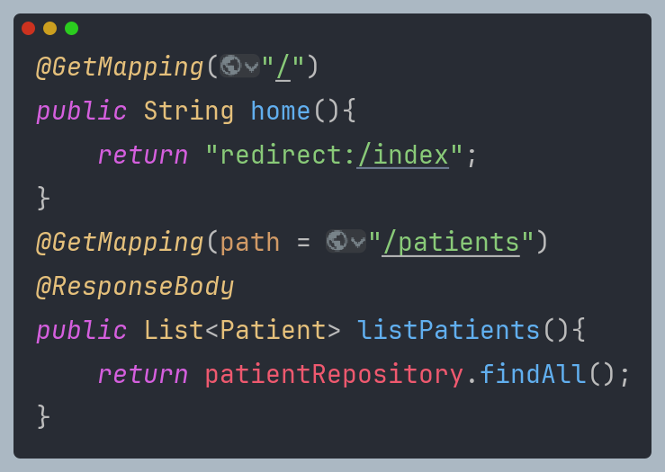
<li>Créer les vues basées sur Thymeleaf</li>
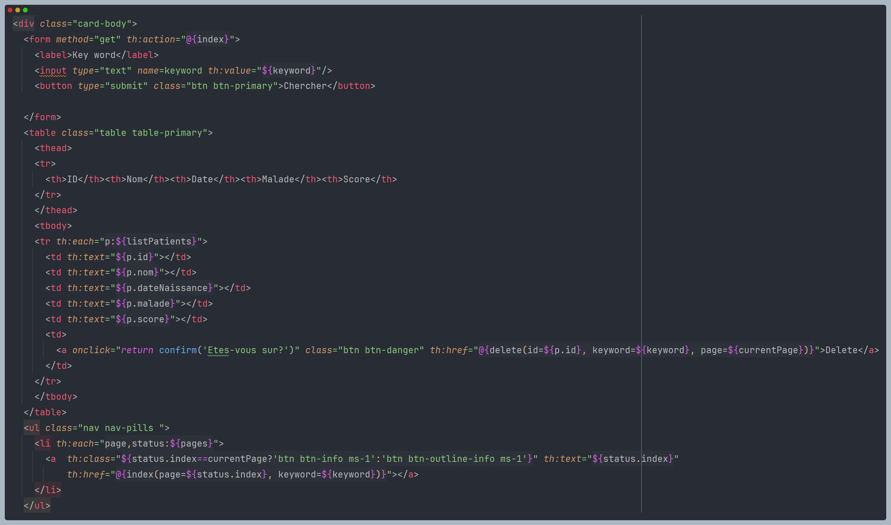
</ol>

<h2>La validation des formulaires : </h2>
<h3>La dépendence utilisée :</h3>
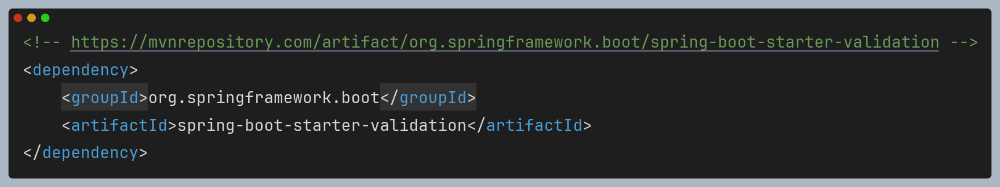

Cette dépendance fournit des fonctionnalités de validation en intégrant la validation de Bean 
de Java (JSR-380) dans Spring Boot. On peut maintenant créer des classes de modèle pour vos formulaires 
et utiliser des annotations de validation pour définir les contraintes sur les champs de ces classes.

Maintenant, on peut utiliser les annotations pour valider les champs :

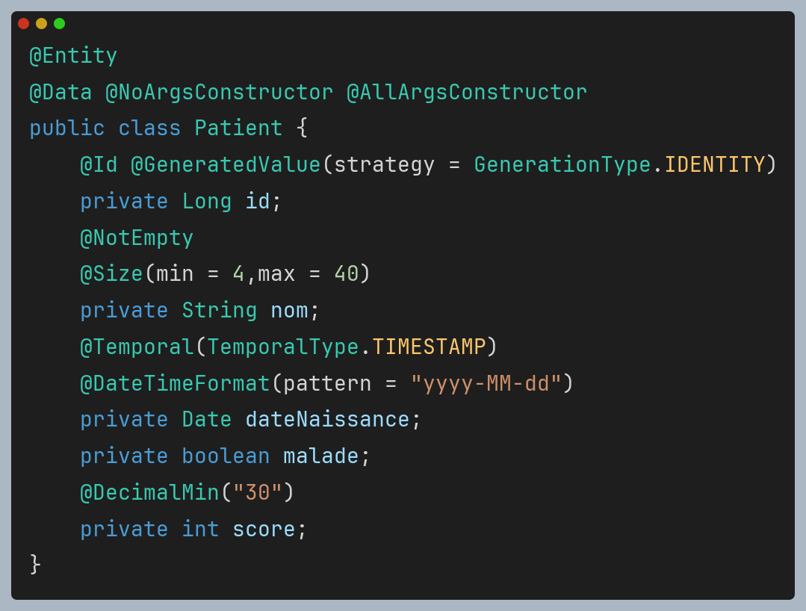
<h2>La page template Layout : </h2>
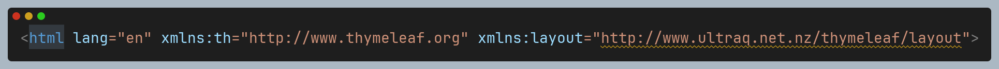

Container content : 

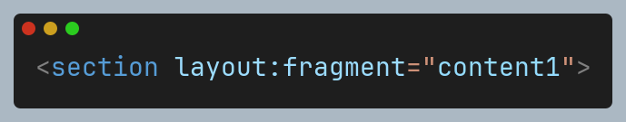

Le principe du template layout dans Thymeleaf est d'avoir un modèle de mise en page (layout)
qui définit la structure générale de nos pages web, avec des emplacements réservés pour le
contenu spécifique de chaque page. Cela permet de créer un modèle de conception cohérent pour notre 
site web tout en réutilisant certaines parties communes.

<h2>Spring Security</h2>

Spring Security est un framework puissant et hautement personnalisable qui fournit des 
fonctionnalités de sécurité pour les applications Java. Son rôle est de gérer l'authentification,
l'autorisation et la protection contre les attaques pour les applications basées sur Spring.

<h3>Enoncé : </h3>

Sécuriser l'application en intégrant un système d'authentification basé sur Spring Security avec 
les trois stratégies : InMemoryAuthentification, JdbcAuthentification et UserSetailsService.

<h3>Les dépendances : </h3>
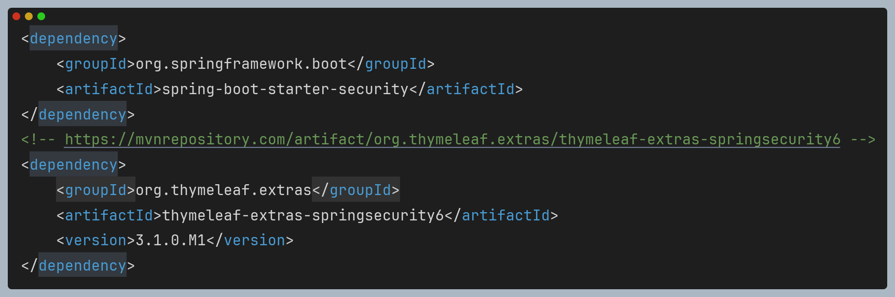</img>
<ol>
<li><h3>InMemoryAuthentification</h3></li>

La stratégie InMemoryAuthentification permet de définir les utilisateurs et leurs 
information d'authentification directement en mémoire, sans nécessiter de stockage externe comme 
une base de données.

Dans la classe SecurityConfig : 

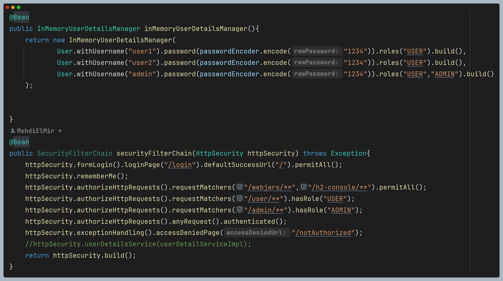
<li><h3>JdbcAuthentification</h3></li>

L'authentification JDBC permet de gérer l'authentification en utilisant une base de donnée relationnelle
pour stocker les informations sur les utilisateurs, y compris leurs identifiants et leurs rôles.
Cela offre une solution plus robuste et extensible que l'authentification en mémoire pour des 
applications réelles.

application.properties : 

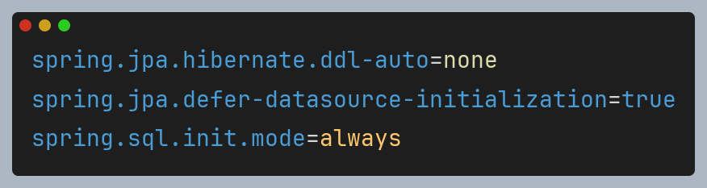

Avec cette configuration, Spring Boot va chercher un script Sql et va l"executer.
Dans le script schema.sql qui se trouve dans ressources, On a mis les tables des utilisateurs
et les roles qui seront ajoutés à la base de données.

Dans la classe SecurityConfig :

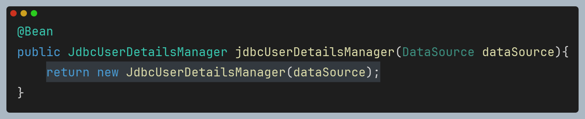

Dans la classe HopitalWebApplication :

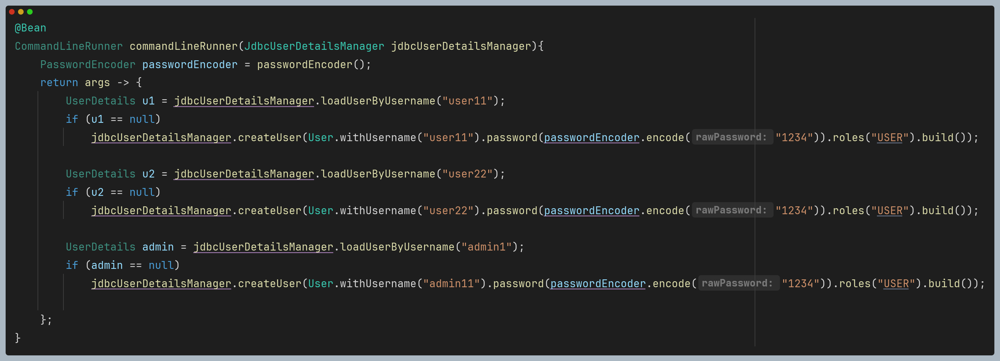
<li><h3>UserDetailsService</h3></li>

L'utilisation de UserDetailsService offre une grande flexibilité car elle permet de charger les détails de l'utilisateur à partir de différentes sources de données tout en intégrant cette logique au processus d'authentification de Spring Security. Cela permet une gestion efficace et personnalisée des utilisateurs dans votre application.

En général, on commence par créer une interface AccountService qui va contenir les méthoders pour ajouter les utilisateurs et leur roles et même affecter un rôle à un utilisateur ou bien le supprimer.

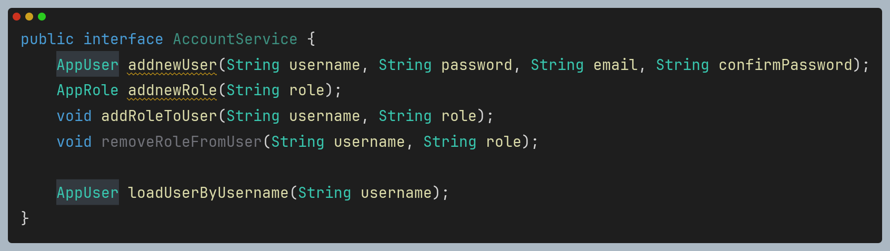

Puis on implémente cette interface pour ajouter notre Code

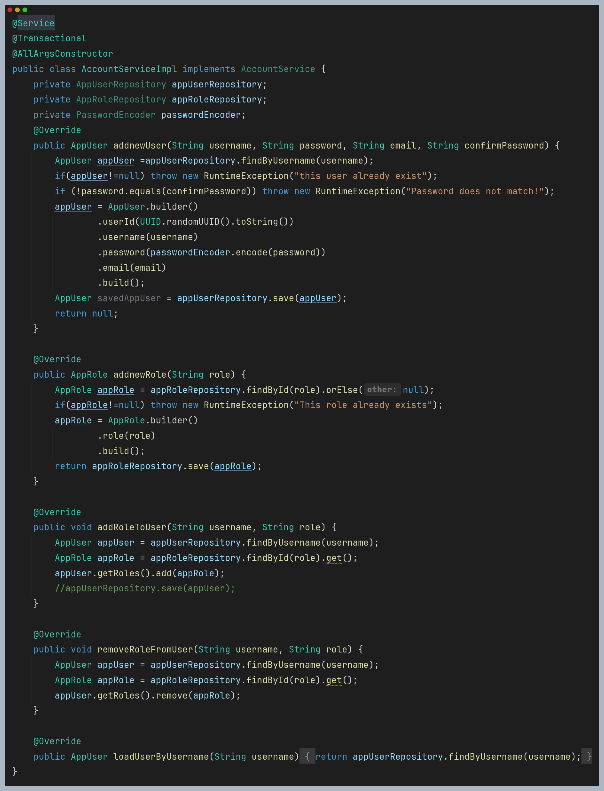

UserDetailsService est une interface fondamentale de Spring Security utilisée pour charger les détails de l'utilisateur lors de l'authentification. Son rôle principal est de récupérer les informations spécifiques d'un utilisateur (telles que les informations d'identification, les rôles, les autorisations) à partir d'une source de données, souvent une base de données ou tout autre système de stockage.

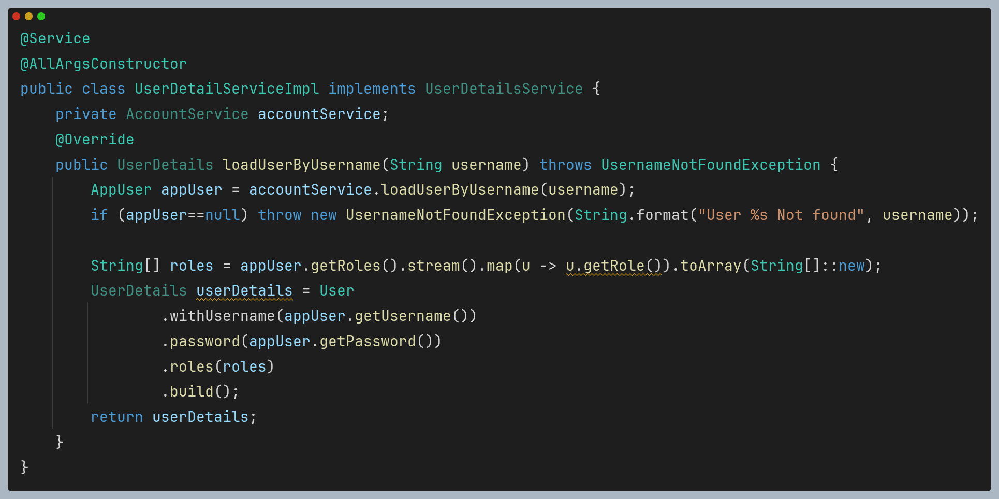

Maintenant, pour ajouter des utilisateurs dans notre base de données, on doit executer cette méthode :

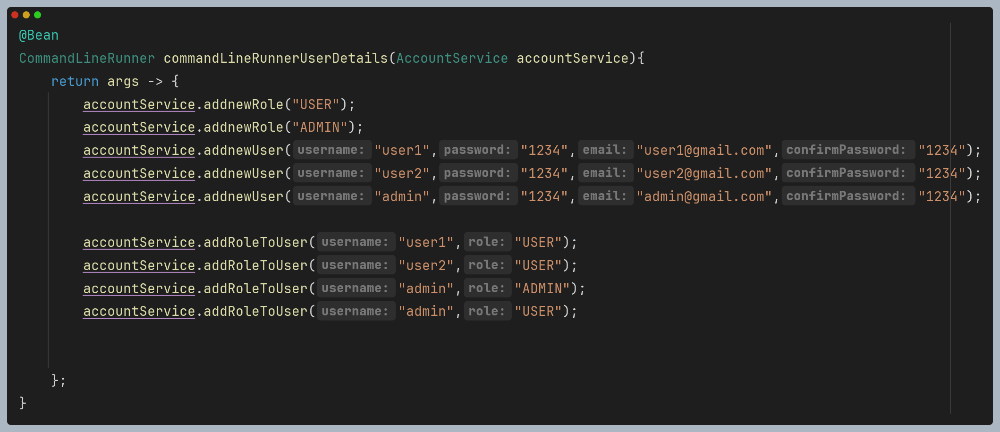
</ol>
<h3>Conclusion</h3>

Cette application Spring Boot avec Spring Security offre une gestion robuste des patients tout en mettant l'accent sur la sécurité. En intégrant des fonctionnalités flexibles, telles que la pagination et la recherche, et en personnalisant l'authentification avec InMemoryAuthentication, JdbcAuthentication et UserDetailsService, l'application allie efficacité, adaptabilité et sécurité.
